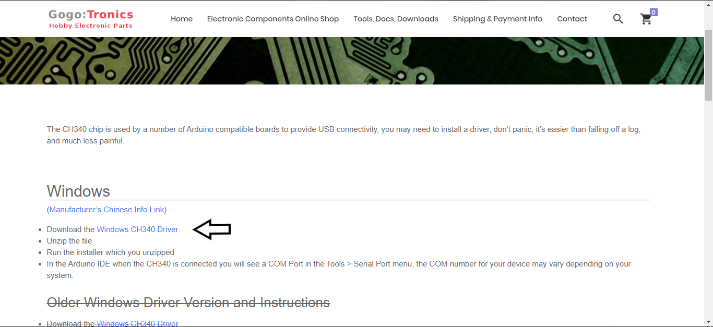
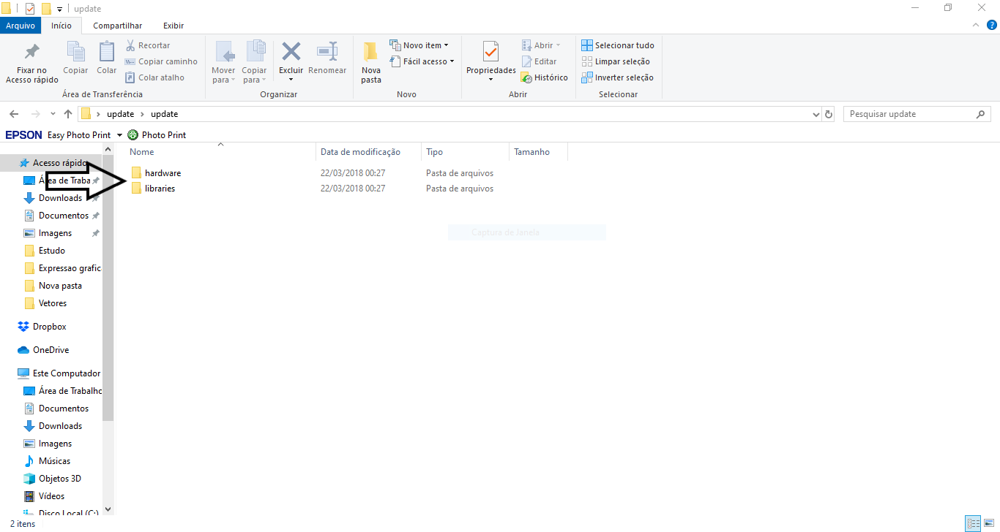

# Tutorial para baixar e instalar o driver CH340

## Fazendo download do driver

Para que se possa utilizar o Wavgat na software do arduino Uno, primeiro é necessário baixar o driver CH340. (Acesse o site clicando [aqui](https://sparks.gogo.co.nz/ch340.html)).

  

- Instale o Driver.

Em seguida, faça o download da pasta com os updates de compatibilidade para o Wavgat clicando [aqui](https://drive.google.com/file/d/10gwrG9uTDwaEO-7EudsmBkfgdcyrcABI/view).

- Extraia os arquivos e cole os arquivos hardware e libraries dentro das respectivas pastas no diretório onde está instalado o software do arduino.

  

